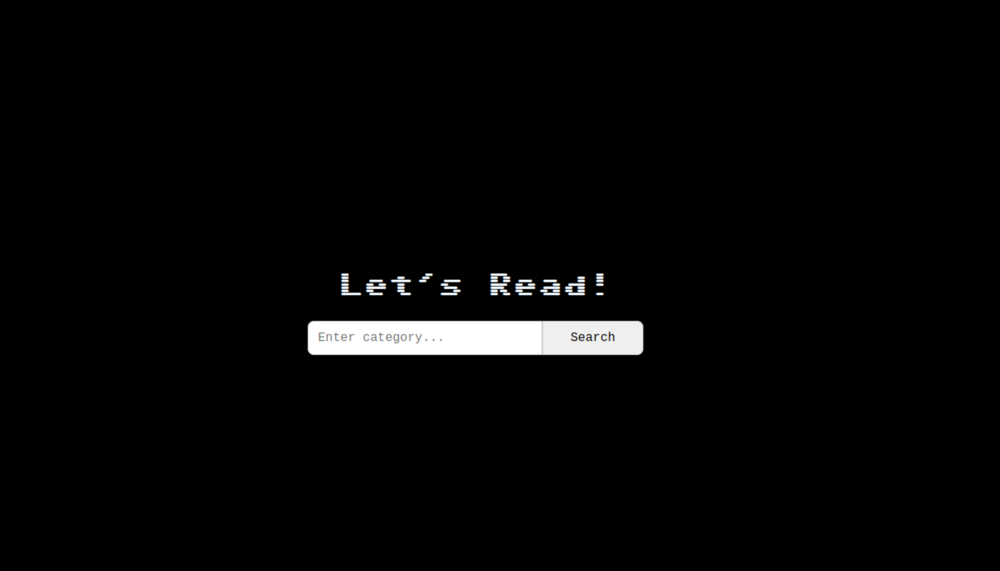

# Progetto-JavaScript-Advanced-di-Giovanni-Bono
Books library 
<a name="readme-top"></a>

<!-- PROJECT HEAD -->
<br />
  <h1 align="center">Progetto-JavaScript-Advance-di-Giovanni-Bono</h1>

  <p align="center">
    An app that  allows you to manage a books library.
    <br />
    <a href="https://github.com/giobn00/Progetto-JavaScript-Advanced-di-Giovanni-Bono"><strong>Explore the docs »</strong></a>
    <br />
    <br />
    <a href="https://textbook.giovannibono.com/">View Demo</a>
    ·
    <a href="https://github.com/giobn00/Progetto-JavaScript-Advanced-di-Giovanni-Bono/issues">Report Bug</a>
    ·
    <a href="https://github.com/giobn00/Progetto-JavaScript-Advanced-di-Giovanni-Bono/issues">Request Feature</a>
  </p>
</div>

<!-- Table of Contents -->
<details>
  <summary>Table of Contents</summary>
  <ol>
    <li>
      <a href="#about-the-project">About The Project</a>
      <ul>
        <li><a href="#built-with">Built With</a></li>
      </ul>
    </li>
    <li>
      <a href="#getting-started">Getting Started</a>
      <ul>
        <li><a href="#installation">installation</a></li>
      </ul>
    </li>
    <li><a href="#usage">Usage</a></li>
    <li><a href="#contact">Contact</a></li>
  </ol>
</details>

<!-- ABOUT THE PROJECT -->
  # About The Project
<div align="center">
  
</div>

An app that  allows you to manage a books library where you can search for category.
The app will return  all the book in the selected category and show them with their title and author.

<p align="right">(<a href="#readme-top">back to top</a>)</p>

### Built With

To create this prject I use the following tools

* [![javascript][javascript.com]][javascript-url]
* ![HTML][HTML.com]
* ![CSS][CSS.com]


<p align="right">(<a href="#readme-top">back to top</a>)</p>

## Getting Started
### Installation

You can copy this project using the command prompt below

1. Clone the repo
   ```sh
   git clone https://github.com/giobn00/Progetto-JavaScript-Advanced-di-Giovanni-Bono.git
   ```

<p align="right">(<a href="#readme-top">back to top</a>)</p>

## Usage

Enter the name of the category you want to see in the search bar, then click on "Search". If there are no results relating to your request, a warning message will appear. Otherwise a list of related books will appear. You can also read the description of the desired book by clicking the "View description" button.

<p align="right">(<a href="#readme-top">back to top</a>)</p>

## Contact

Giovanni Bono - [@portfolio](https://developer.giovannibono.com/) - me@giovannibono.com

Project Link: [https://count.giovannibono.com/](https://count.giovannibono.com/)

<p align="right">(<a href="#readme-top">back to top</a>)</p>


[javascript-url]: https://javascript.com
[javascript.com]: https://img.shields.io/badge/JavaScript-323330?style=for-the-badge&logo=javascript&logoColor=F7DF1E
[HTML.com]: https://img.shields.io/badge/HTML5-E34F26?style=for-the-badge&logo=html5&logoColor=white
[CSS.com]:https://img.shields.io/badge/CSS3-1572B6?style=for-the-badge&logo=css3&logoColor=white